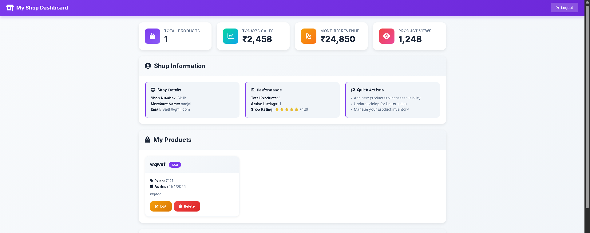

# Super Mall Web Application

## 📋 Project Overview
A complete web application that demonstrates a mall management system with admin and user portals. Built with **pure JavaScript** and **localStorage** for data persistence - no external dependencies or API keys required.(This entire project is set to run on sample data local database, if need dataserver u can implement a firebase just altering the storage with firebase data)

## 🖼️ Project Screenshots

### 🧩 Dashboard View

### 🛍️ User Interface

### 📊 Admin dashboard Overview

### 📊 user dashboard Overview

## 🎯 Key Features
- Smart Authentication
- Dual login (Email or Shop Number)
- Role-based access control
- Session management
- Secure logout

## Modern UI/UX

- Gradient backgrounds and shadows
- Interactive hover effects
- Responsive grid layouts
- Professional typography

## Data Management

- Real-time updates across tabs
- Bulk operations support
- Data validation and error handling
- Local storage persistence

## 🛠️ Technical Implementation

### Architecture
- **Frontend:** HTML5, CSS3, Vanilla JavaScript (ES6+)
- **Data Layer:** Browser localStorage with mock Firebase API
- **Authentication:** Role-based access control
- **Logging:** Comprehensive activity logging

🚀 Deployment
## Local Deployment

1. Clone the repository via vs code 
2. install live server in vs code 
3. After live server install there is icon name go live in bottom right corner of vs code 
4. run the index.html with live server in vs code test all use admin dashboard,
5. Test all use admin dashboard, user dashboard get the output and see how this project work 

Access via localhost

## 🚀 Quick Start

1. Clone or download the project files
2. Open `index.html` in any modern web browser
3. Use demo credentials to explore features

### Demo Credentials:
- **Admin:** admin@supermall.com / admin123
- **User:** Register any new account

## 📊 Database Schema (Mock)
The application uses a structured localStorage-based database with collections for:
- Users, Shops, Products, Offers, Categories, Logs

## 📈 Performance Optimizations
- Efficient DOM manipulation
- Debounced search operations
- Lazy loading ready
- Minimal memory footprint

## 🧪 Testing Coverage
- Authentication flows
- CRUD operations
- Filter and search functionality
- Responsive design testing
- Error handling

## 📝 Submission Contents
- Complete source code
- Documentation
- Demo instructions
- No external dependencies
- Ready for evaluation

## 🔮 Future Enhancement Ready
The architecture is designed to easily replace mock Firebase with real Firebase when needed.