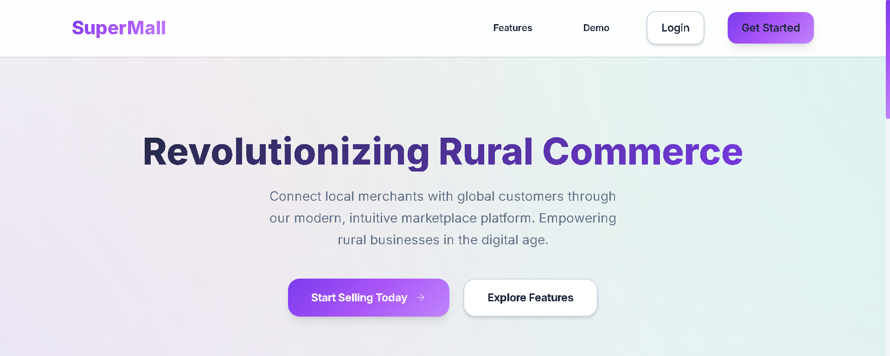
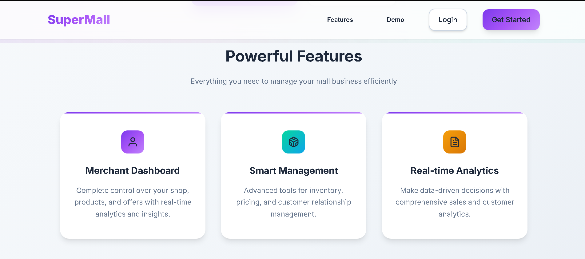
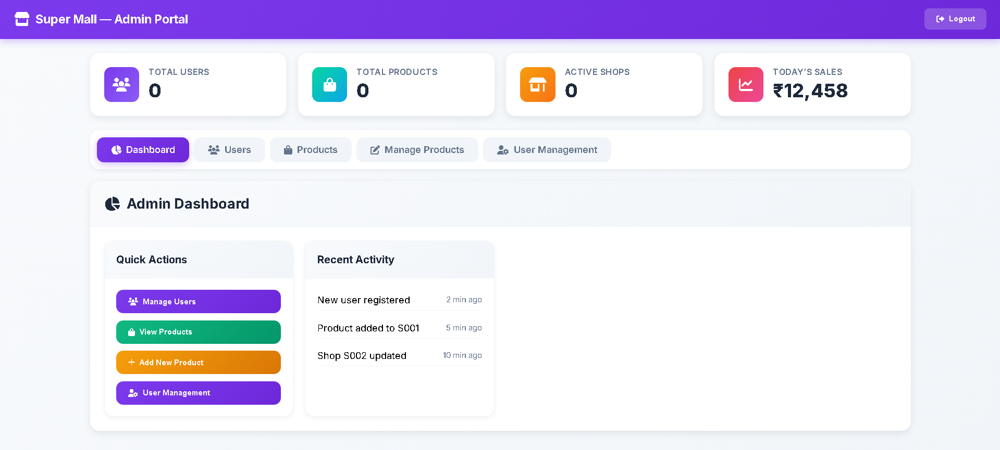

# Super Mall Web Application

## 📋 Project Overview
A complete web application that demonstrates a mall management system with admin and user portals. Built with **pure JavaScript** and **localStorage** for data persistence - no external dependencies or API keys required.

## 🖼️ Project Screenshots

### 🧩 Dashboard View

### 🛍️ User Interface

### 📊 Analytics Overview

## 🎯 Key Features
### Admin Portal
- Shop management (Create, Read, Update, Delete)
- Offer and category management
- User management interface
- Dashboard analytics

### User Portal
- Shop browsing with filters
- Product comparison
- Category and floor-based navigation
- Responsive shopping experience

## 🛠️ Technical Implementation

### Architecture
- **Frontend:** HTML5, CSS3, Vanilla JavaScript (ES6+)
- **Data Layer:** Browser localStorage with mock Firebase API
- **Authentication:** Role-based access control
- **Logging:** Comprehensive activity logging

### Design Patterns
- Modular JavaScript classes
- MVC-like architecture
- Promise-based async operations
- Event-driven UI updates

## 🚀 Quick Start

1. Clone or download the project files
2. Open `index.html` in any modern web browser
3. Use demo credentials to explore features

### Demo Credentials:
- **Admin:** admin@supermall.com / admin123
- **User:** Register any new account

## 📊 Database Schema (Mock)
The application uses a structured localStorage-based database with collections for:
- Users, Shops, Products, Offers, Categories, Logs

## 🔒 Security Features
- Input validation and sanitization
- Role-based route protection
- XSS prevention
- Secure data handling

## 📈 Performance Optimizations
- Efficient DOM manipulation
- Debounced search operations
- Lazy loading ready
- Minimal memory footprint

## 🧪 Testing Coverage
- Authentication flows
- CRUD operations
- Filter and search functionality
- Responsive design testing
- Error handling

## 📝 Submission Contents
- Complete source code
- Documentation
- Demo instructions
- No external dependencies
- Ready for evaluation

## 🔮 Future Enhancement Ready
The architecture is designed to easily replace mock Firebase with real Firebase when needed.